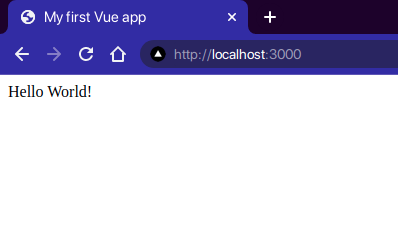

# Send SMS With Twilio and Vue
Don't you wish you could reply to texts at 110wpm? **Me too**. That's why we're going to learn how to utilize Twilio's API to send messages right from our own web app. We're going to use some new frameworks here, too. We will get a nice overview of the capabillity of Twilio's API through a <code>Vue.JS</code> app.

Let's get started.

### Overview
Let's talk about what we're going to build for a moment before we dig into the code. This will help us keep a clear picture of our goals and help things make a little more sense.

We're going to have the following major components:
- HTML Document
- Vue App
- Local Express Server

We're going to be using a simple express server to get our app into the browser. Then, we will add additional capability to this server in order to handle requests to Twilio's API for sending messages.

**So far, so good?**

### Project Structure
Here's a reference to what we will expect the final file tree to look like. You may go ahead and create this now and we can fill these in later. 

> If you prefer to just follow along you can refer to the source code [here]()

<pre>
twilio-sms-vue
│   .env
│   .gitignore
│   INSTRUCTIONS.md
│   package.json
│   yarn.lock
│
└───src
│   │   index.js
│   │
│   └───public
│       │   index.css
│       │   index.html
│       │   send.webp
</pre>

Our <code>.env</code> file is going to store our credentials for us.  
Our <code>index.js</code> file is going to hold the logic for our server.  
Our <code>index.html</code> file is going to hold our markup for our Vue app.  

## Let's dig in

## Server
We need to serve this app to the browser somehow, right? We're going to make something lightweight and easy so we can focus on the meat and potatos: Vue & Twilio.

Add the following packages via your preferred flavor of package manager ( npm or yarn )
<pre>
// NPM
npm i express dotenv twilio && npm -D

// Yarn
yarn add express dotenv twilio && yarn add -D nodemon
</pre>

To make our life easier we're going to also add nodemon so our server reloads when we make changes. To do this, we need to add a script into our <code>package.json</code>
<pre>
  "scripts": {
    "start": "nodemon -e html,js ./src/server.js"
  },
</pre>

If you're not too familiar with Express, I encourage you to check out the documentation [here](). Go ahead and set up a simple server like so:

<pre>
// Express Server
const express = require("express");
const app = express();
const path = require("path");
const port = 3000;

// Parse Incoming JSON
app.use(express.json());

// Serve static content from our public directory ( images, stylesheets, etc.)
app.use(express.static(path.join(__dirname, "public")));

// Our root route
app.get("/", (_req, res) => {
  res.sendFile(path.resolve(__dirname, "public/index.html"));
});
</pre>

Before we fire up the server, let's put some content in our HTML file. There are a few ways to install Vue. In this example we're going to be using the CDN so we can learn about the core API and not focus so much on tooling.

To do this, you need to add a script tag to the CDN for Vue. Once you add this into your document, you'll need to make sure you have a few other items:
- Your VueJS App needs to attach to a DOM node. We will use a single div to encapsulate our whole app. We're going to give this DOM Node the #app id.
- We need another script that creates a global app object which we will get from instantiating a Vue object. In here we will provide the id for our root component.

Below is a boilerplate sample you may use to get started:
<pre>
&lt;!DOCTYPE html&gt;
&lt;html&gt;
  &lt;head&gt;
    &lt;title&gt;My first Vue app&lt;/title&gt;
    &lt;script src="https://unpkg.com/vue"&gt;&lt;/script&gt;
    &lt;link rel="stylesheet" href="index.css" type="text/css" /&gt;
  &lt;/head&gt;
  &lt;body&gt;
    &lt;div id="app"&gt;
      {{ message }}
    &lt;/div&gt;

    &lt;script&gt;
      var app = new Vue({
        el: "#app",
        data: {
          message: "Hello Vue!"
        }
      });
    &lt;/script&gt;
  &lt;/body&gt;
&lt;/html&gt;
</pre>

Let's go ahead and get our server going now that we have some content to show. Start your app by running <code>npm start</code> or <code>yarn start</code>. Nodemon will start our server and watch for changes.

Voila!
***

TBD...=>

- ## Go to Twilio
  - ### Talk about Creating Acccount
  - ### Get AccountSID & Token
- ## Server
  - ### Explain(lightly)/Add creds to env
  - ### Add credentials to Env
  - ### Add logic to server w/ magic test number
- ## Back to twilio
  - ### Get phone number to test with
  - ### Verify personal phone number for real-world test
- ## Back to Server
  - ### replace sender number with new purchased number
- ## HTML
  - ### Provide html markup for form
  - ### Discuss how to attach event listeners to dom elements with Vue
  - ### Discuss state management in vue
  - ### Build fetch call to server
- ## Back to Twilio API docs or reference for more detailed guides
